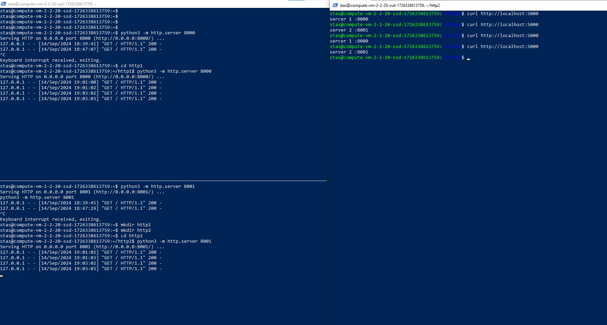
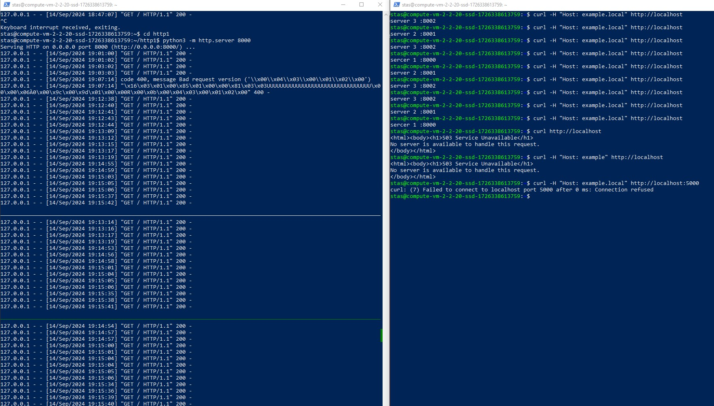
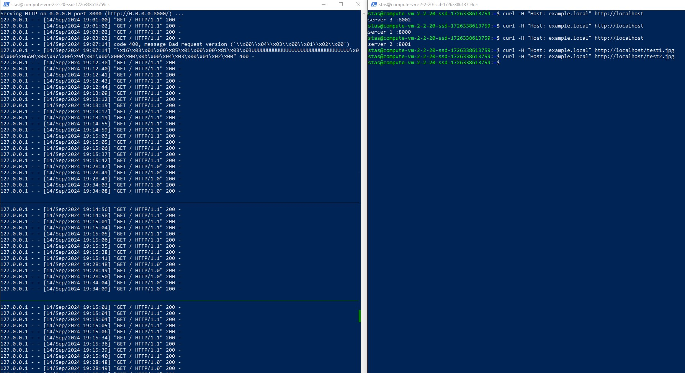
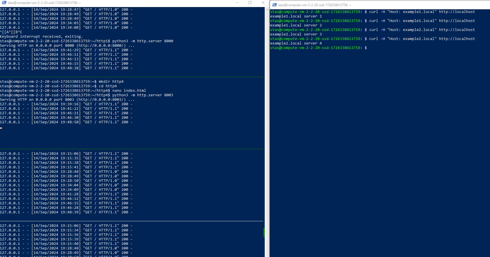

# Домашнее задание к занятию 2 «Кластеризация и балансировка нагрузки»

### Цель задания
В результате выполнения этого задания вы научитесь:
1. Настраивать балансировку с помощью HAProxy
2. Настраивать связку HAProxy + Nginx

------

### Чеклист готовности к домашнему заданию

1. Установлена операционная система Ubuntu на виртуальную машину и имеется доступ к терминалу
2. Просмотрены конфигурационные файлы, рассматриваемые на лекции, которые находятся по [ссылке](2/)


------


### Инструкция по выполнению домашнего задания

1. Сделайте fork [репозитория c шаблоном решения](https://github.com/netology-code/sys-pattern-homework) к себе в Github и переименуйте его по названию или номеру занятия, например, https://github.com/имя-вашего-репозитория/gitlab-hw или https://github.com/имя-вашего-репозитория/8-03-hw).
2. Выполните клонирование этого репозитория к себе на ПК с помощью команды git clone.
3. Выполните домашнее задание и заполните у себя локально этот файл README.md:
   - впишите вверху название занятия и ваши фамилию и имя;
   - в каждом задании добавьте решение в требуемом виде: текст/код/скриншоты/ссылка;
   - для корректного добавления скриншотов воспользуйтесь инструкцией [«Как вставить скриншот в шаблон с решением»](https://github.com/netology-code/sys-pattern-homework/blob/main/screen-instruction.md);
   - при оформлении используйте возможности языка разметки md. Коротко об этом можно посмотреть в [инструкции по MarkDown](https://github.com/netology-code/sys-pattern-homework/blob/main/md-instruction.md).
4. После завершения работы над домашним заданием сделайте коммит (git commit -m "comment") и отправьте его на Github (git push origin).
5. Для проверки домашнего задания преподавателем в личном кабинете прикрепите и отправьте ссылку на решение в виде md-файла в вашем Github.
6. Любые вопросы задавайте в чате учебной группы и/или в разделе «Вопросы по заданию» в личном кабинете.


------


### Задание 1
- Запустите два simple python сервера на своей виртуальной машине на разных портах
- Установите и настройте HAProxy, воспользуйтесь материалами к лекции по [ссылке](2/)
- Настройте балансировку Round-robin на 4 уровне.
- На проверку направьте конфигурационный файл haproxy, скриншоты, где видно перенаправление запросов на разные серверы при обращении к HAProxy.

### Решение 1

```
global
    log /dev/log    local0
    log /dev/log    local1 notice
    chroot /var/lib/haproxy
    stats socket /run/haproxy/admin.sock mode 660 level admin
    stats timeout 30s
    user haproxy
    group haproxy
    daemon

defaults
    log     global
    mode    tcp  # Режим TCP для L4 балансировки
    option  tcplog
    timeout connect 5000ms
    timeout client  50000ms
    timeout server  50000ms

frontend python_front
    bind *:5000  # Прослушивание на порту 5000
    default_backend python_back

backend python_back
    balance roundrobin  # Балансировка по кругу
    server python1 127.0.0.1:8000 check  # Первый Python сервер на порту 8000
    server python2 127.0.0.1:8001 check  # Второй Python сервер на порту 8001
```
  

### Задание 2
- Запустите три simple python сервера на своей виртуальной машине на разных портах
- Настройте балансировку Weighted Round Robin на 7 уровне, чтобы первый сервер имел вес 2, второй - 3, а третий - 4
- HAproxy должен балансировать только тот http-трафик, который адресован домену example.local
- На проверку направьте конфигурационный файл haproxy, скриншоты, где видно перенаправление запросов на разные серверы при обращении к HAProxy c использованием домена example.local и без него.

### Решение 2
```
global
    log /dev/log    local0
    log /dev/log    local1 notice
    chroot /var/lib/haproxy
    stats socket /run/haproxy/admin.sock mode 660 level admin
    stats timeout 30s
    user haproxy
    group haproxy
    daemon

defaults
    log     global
    mode    http  # Режим HTTP для L7 балансировки
    option  httplog
    timeout connect 5000ms
    timeout client  50000ms
    timeout server  50000ms

frontend http_front
    bind *:80  # Принимаем HTTP-трафик на порту 80
    acl host_example_local hdr(host) -i example.local  # Определяем ACL для домена example.local
    use_backend python_back if host_example_local  # Используем backend только для домена example.local

backend python_back
    balance roundrobin  # Алгоритм Weighted Round Robin (по умолчанию roundrobin)
    server python1 127.0.0.1:8000 weight 2 check  # Первый сервер с весом 2
    server python2 127.0.0.1:8001 weight 3 check  # Второй сервер с весом 3
    server python3 127.0.0.1:8002 weight 4 check  # Третий сервер с весом 4
```
 
---

## Задания со звёздочкой*
Эти задания дополнительные. Их можно не выполнять. На зачёт это не повлияет. Вы можете их выполнить, если хотите глубже разобраться в материале.

---

### Задание 3*
- Настройте связку HAProxy + Nginx как было показано на лекции.
- Настройте Nginx так, чтобы файлы .jpg выдавались самим Nginx (предварительно разместите несколько тестовых картинок в директории /var/www/), а остальные запросы переадресовывались на HAProxy, который в свою очередь переадресовывал их на два Simple Python server.
- На проверку направьте конфигурационные файлы nginx, HAProxy, скриншоты с запросами jpg картинок и других файлов на Simple Python Server, демонстрирующие корректную настройку.
### Решение 3
```
server {
    listen 80;
    server_name example.local;

    root /var/www/example.local;

    # Обслуживаем .jpg файлы напрямую из директории /var/www/example.local
    location ~* \.jpg$ {
        access_log off;
        expires 30d;
    }

    # Прокси для всех остальных запросов на HAProxy
    location / {
        proxy_pass http://127.0.0.1:5000;  # Прокси на HAProxy, который слушает на порту 5000
        proxy_set_header Host $host;
        proxy_set_header X-Real-IP $remote_addr;
        proxy_set_header X-Forwarded-For $proxy_add_x_forwarded_for;
        proxy_set_header X-Forwarded-Proto $scheme;
    }
}
```
```
global
    log /dev/log    local0
    log /dev/log    local1 notice
    chroot /var/lib/haproxy
    stats socket /run/haproxy/admin.sock mode 660 level admin
    stats timeout 30s
    user haproxy
    group haproxy
    daemon

defaults
    log     global
    mode    tcp  # Работаем в TCP режиме (L4)
    option  tcplog
    timeout connect 5000ms
    timeout client  50000ms
    timeout server  50000ms

frontend tcp_front
    bind *:5000  # HAProxy слушает на порту 5000 для TCP трафика
    default_backend python_back

backend python_back
    balance roundrobin  # Алгоритм балансировки
    server python1 127.0.0.1:8000 check  # Первый Python сервер
    server python2 127.0.0.1:8001 check  # Второй Python сервер
    server python3 127.0.0.1:8002 check  # Третий Python сервер
```



---

### Задание 4*
- Запустите 4 simple python сервера на разных портах.
- Первые два сервера будут выдавать страницу index.html вашего сайта example1.local (в файле index.html напишите example1.local)
- Вторые два сервера будут выдавать страницу index.html вашего сайта example2.local (в файле index.html напишите example2.local)
- Настройте два бэкенда HAProxy
- Настройте фронтенд HAProxy так, чтобы в зависимости от запрашиваемого сайта example1.local или example2.local запросы перенаправлялись на разные бэкенды HAProxy
- На проверку направьте конфигурационный файл HAProxy, скриншоты, демонстрирующие запросы к разным фронтендам и ответам от разных бэкендов.
### Решение 4
```
global
    log /dev/log    local0
    log /dev/log    local1 notice
    chroot /var/lib/haproxy
    stats socket /run/haproxy/admin.sock mode 660 level admin
    stats timeout 30s
    user haproxy
    group haproxy
    daemon

defaults
    log     global
    mode    http  # Работаем на уровне HTTP (L7)
    option  httplog
    timeout connect 5000ms
    timeout client  50000ms
    timeout server  50000ms

# Фронтенд, который принимает запросы и перенаправляет на разные бэкенды
frontend http_front
    bind *:80  # Прослушиваем HTTP на порту 80

    # ACL для фильтрации запросов на example1.local и example2.local
    acl host_example1 hdr(host) -i example1.local
    acl host_example2 hdr(host) -i example2.local

    # Используем бэкенды в зависимости от домена
    use_backend python_back_example1 if host_example1
    use_backend python_back_example2 if host_example2

# Бэкенд для example1.local (два Python-сервера)
backend python_back_example1
    balance roundrobin
    server python1 127.0.0.1:8000 check
    server python2 127.0.0.1:8001 check

# Бэкенд для example2.local (два Python-сервера)
backend python_back_example2
    balance roundrobin
    server python3 127.0.0.1:8002 check
    server python4 127.0.0.1:8003 check

```


------

### Правила приема работы

1. Необходимо следовать инструкции по выполнению домашнего задания, используя для оформления репозиторий Github
2. В ответе необходимо прикладывать требуемые материалы - скриншоты, конфигурационные файлы, скрипты. Необходимые материалы для получения зачета указаны в каждом задании.


------

### Критерии оценки

- Зачет - выполнены все задания, ответы даны в развернутой форме, приложены требуемые скриншоты, конфигурационные файлы, скрипты. В выполненных заданиях нет противоречий и нарушения логики
- На доработку - задание выполнено частично или не выполнено, в логике выполнения заданий есть противоречия, существенные недостатки, приложены не все требуемые материалы.
